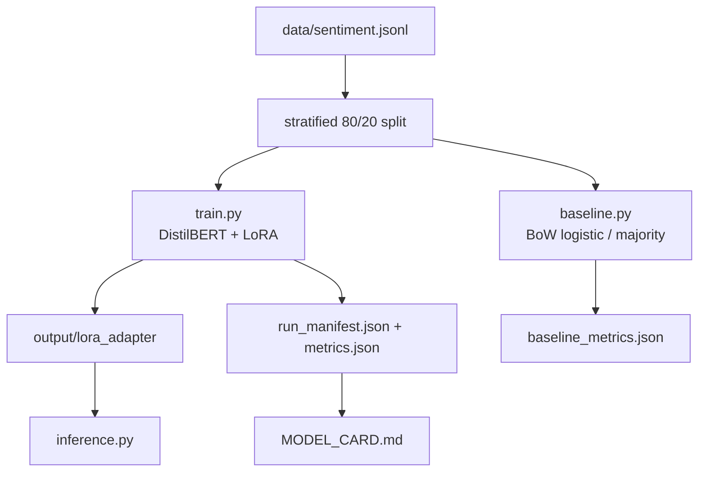

# Architecture — LLM Fine-tune LoRA

Parameter-efficient fine-tuning of DistilBERT for binary sentiment with LoRA/PEFT,
plus a CPU-friendly baseline and reproducibility manifests.

## Components

| File | Role |
|------|------|
| `train.py` | LoRA fine-tune (`r=8`, `α=16` on `q_lin`/`v_lin`); `--fast` / `--max_steps` for CI |
| `baseline.py` | Fair comparison on the same split (majority + sklearn BoW logistic) |
| `inference.py` | Load base + PEFT adapter; predict label + confidence |
| `repro.py` | Dataset SHA-256, lib versions, run manifest writer |
| `tests/` | Pure-Python data/manifest tests; heavy train/infer smokes skip without deps |

## Artifact policy

See [ARTIFACTS.md](../ARTIFACTS.md): the small demo adapter is committed for
reproducible inference; larger artifacts belong in Releases with checksums in
the run manifest.

## Evaluation story

1. Train LoRA → `metrics.json` (accuracy / F1).
2. Run `baseline.py --fast` → `baseline_metrics.json`.
3. Compare in the model card so readers see LoRA lift over a simple baseline.
